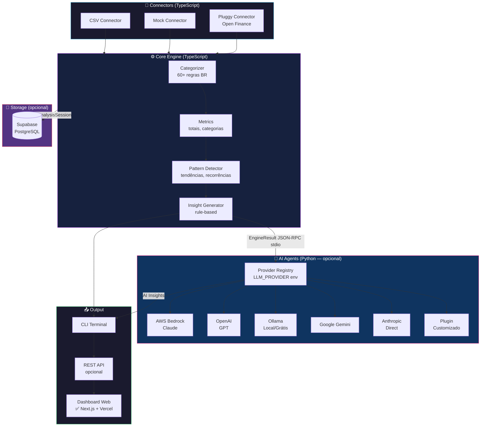
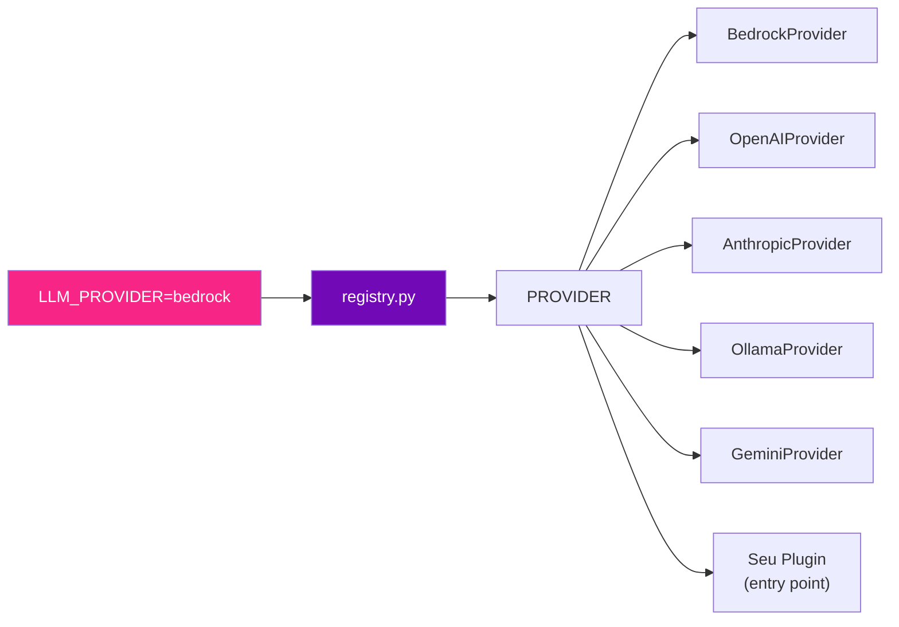
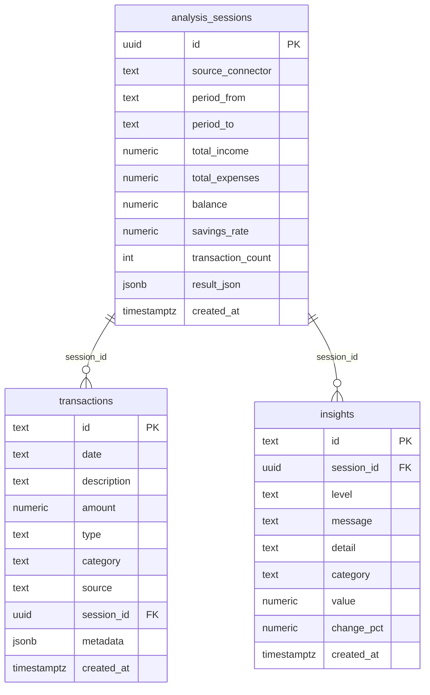
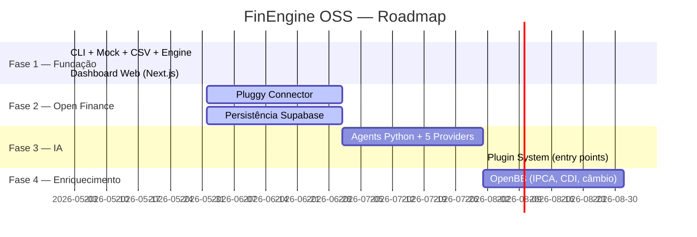

<div align="center">

# 💰 FinEngine OSS

### Motor de Inteligência Financeira Open Source

**Transforme dados financeiros em decisões inteligentes.**  
Conecte suas contas, importe CSVs, gere insights — com ou sem IA.

[](LICENSE)
[](https://nodejs.org)
[](https://typescriptlang.org)
[](https://pnpm.io)
[](https://python.org)
[](CONTRIBUTING.md)
[](https://opensource.org)
[](https://open-source-finance-bank-web.vercel.app/)

[🌐 Demo Online](https://open-source-finance-bank-web.vercel.app/) • [📖 Documentação](#-documentação) • [🚀 Quick Start](#-quick-start-30-segundos) • [🤝 Contribuir](CONTRIBUTING.md) • [🐛 Issues](https://github.com/OsmarZM/OpenSource-FinanceBank/issues)

</div>

---

## 📋 Índice

- [O que é?](#-o-que-é)
- [Por que usar?](#-por-que-usar)
- [Funcionalidades](#-funcionalidades)
- [Quick Start](#-quick-start-30-segundos)
- [Arquitetura](#-arquitetura)
- [Estrutura do Projeto](#-estrutura-do-projeto)
- [Configuração](#-configuração)
- [Comandos CLI](#-comandos-cli)
- [Connectors](#-connectors)
- [Integração com IA](#-integração-com-ia)
- [Banco de Dados (Supabase)](#-banco-de-dados-supabase)
- [Dashboard Web](#-dashboard-web)
- [Docker](#-docker)
- [Roadmap](#-roadmap)
- [Documentação Completa](#-documentação)
- [Contribuindo](#-contribuindo)
- [Licença](#-licença)

---

## 🧠 O que é?

**FinEngine OSS** é uma ferramenta local-first para análise de dados financeiros pessoais. Ela permite:

- **Conectar contas bancárias** via Open Finance (Pluggy)
- **Importar extratos** em CSV de qualquer banco
- **Analisar automaticamente** gastos, padrões e tendências
- **Gerar insights** com regras determinísticas ou com IA (Claude, GPT, Gemini, Llama)
- **Persistir resultados** no Supabase
- **Rodar em qualquer lugar** com Docker

Tudo funciona **offline**, sem enviar seus dados para nenhum servidor externo (exceto as APIs que você escolher ativar).

---

## 💡 Por que usar?

| Problema | FinEngine OSS |
|---|---|
| Apps financeiros são fechados | 100% open source, você vê e controla tudo |
| Difícil de customizar | Arquitetura modular com connectors e agents plugáveis |
| Dependência de serviços pagos | Funciona sem qualquer API paga (`pnpm demo`) |
| Lock-in de plataforma | Monorepo híbrido TS+Python, roda em qualquer OS |
| Sem IA ou com IA cara | Escolha seu provider: Bedrock, OpenAI, Ollama (grátis local) |
| Dados na nuvem sem consentimento | Local-first: dados ficam na sua máquina |

---

## ✨ Funcionalidades

### Fase 1 — Disponível agora ✅
- 🎮 **Modo Demo** — Análise instantânea sem nenhuma configuração
- 📄 **CSV Connector** — Importa qualquer extrato bancário (auto-detecção de formato PT/EN)
- 🏷️ **Categorização automática** — 13 categorias com +60 regras para bancos brasileiros
- 📊 **Métricas completas** — Totais, por categoria, taxa de poupança, tendências mensais
- 🔍 **Detecção de padrões** — Tendências de alta/baixa, assinaturas recorrentes, poupança baixa
- 💡 **Insights rule-based** — Análise sem IA, instantânea
- 🖥️ **CLI colorida e interativa** — Interface terminal com gráficos de barras
- 🎨 **Dashboard Web** — Next.js + Tailwind, gráficos interativos, deploy no Vercel → [abrir demo](https://open-source-finance-bank-web.vercel.app/)

### Fase 2 — Em desenvolvimento 🔧
- 🏦 **Pluggy Connector** — Open Finance, +300 bancos brasileiros
- 💾 **Persistência Supabase** — Salve e consulte histórico de análises

### Fase 3+ — Roadmap 📋
- 🤖 **AI Agents** — LLM provider plugável (Bedrock, OpenAI, Anthropic, Ollama, Gemini)
- 🌍 **OpenBB Enrichment** — IPCA, CDI, câmbio em contexto

---

## 🚀 Quick Start (30 segundos)

### Pré-requisitos
- [Node.js 20+](https://nodejs.org)
- [pnpm](https://pnpm.io) (`npm install -g pnpm`)

```bash
# 1. Clone o repositório
git clone https://github.com/OsmarZM/OpenSource-FinanceBank.git
cd OpenSource-FinanceBank

# 2. Instale as dependências
pnpm install

# 3. Build dos pacotes
pnpm build

# 4. Execute o demo (sem nenhuma configuração!)
pnpm demo
```

**Resultado esperado:**

```
🚀  FinEngine OSS — Modo Demo
  Usando dados financeiros simulados para demonstração

✔ 126 transações analisadas

╭─────────────────────────────────────────╮
│  💰 FinEngine OSS — Análise Financeira  │
│  Período: 04/02/2026 – 09/05/2026       │
│  126 transações analisadas              │
╰─────────────────────────────────────────╯

📊  RESUMO FINANCEIRO
  Receitas          R$ 26.300,00
  Despesas          R$ 24.478,80
  ──────────────────────────────
  Saldo              R$ 1.821,20
  Poupança                  6.9%

📂  GASTOS POR CATEGORIA
  Moradia          R$ 9.000,00  36.8%  ███████░░░░░░░░░░░░░
  Alimentação      R$ 6.057,00  24.7%  █████░░░░░░░░░░░░░░░
  ...

💡  INSIGHTS
  🚨  Taxa de poupança muito baixa: 6.9%
  ⚠️   Gastos com alimentação aumentaram 35% no período
  ℹ️   Assinatura recorrente: Netflix — R$ 55,90/mês
```

### Modo interativo

```bash
pnpm --filter @fin-engine/cli run dev
# ou após build:
node packages/cli/dist/index.js start
```

### Com arquivo CSV

```bash
node packages/cli/dist/index.js start
# Selecione: 📄 Importar CSV
# Informe o caminho: examples/sample.csv
```

---

## 🏗️ Arquitetura



---

## 📦 Estrutura do Projeto

```
fin-engine/
│
├── packages/                         # Pacotes TypeScript (pnpm workspaces)
│   ├── types/                        # Tipos compartilhados (Transaction, Insight…)
│   ├── connectors-base/              # Interface abstrata BaseConnector
│   ├── connector-mock/               # Dados simulados realistas (90 dias BR)
│   ├── connector-csv/                # Parser CSV com auto-detecção PT/EN
│   ├── connector-pluggy/             # Open Finance — Fase 2
│   ├── core/                         # Engine: categorizar, métricas, insights
│   ├── database/                     # Cliente Supabase + queries tipadas
│   ├── agents-bridge/                # Bridge TS↔Python (JSON-RPC stdio)
│   ├── cli/                          # Interface terminal (chalk, inquirer, ora)
│   └── api/                          # API REST opcional (Fase 4)
│
├── services/                         # Serviços Python
│   ├── agents/                       # Sidecar LLM (5 providers plugáveis)
│   │   ├── src/agents/
│   │   │   ├── __main__.py           # JSON-RPC stdio loop
│   │   │   ├── insights.py           # Geração de insights com LLM
│   │   │   └── llm/
│   │   │       ├── base.py           # LLMProvider ABC
│   │   │       ├── bedrock.py        # AWS Bedrock (Claude)
│   │   │       ├── openai_provider.py
│   │   │       ├── anthropic_provider.py
│   │   │       ├── ollama_provider.py
│   │   │       ├── gemini_provider.py
│   │   │       └── registry.py       # Carrega provider via LLM_PROVIDER env
│   │   └── Dockerfile
│   └── openbb-enricher/              # Dados macroeconômicos — Fase 4
│
├── apps/
│   ├── web/                          # Dashboard Web (Next.js + Tailwind — deploy Vercel)
│   │   ├── src/app/                  # App Router Next.js
│   │   ├── src/components/          # Dashboard, Charts, SummaryCard, etc.
│   │   └── src/lib/                  # engine.ts, metrics.ts, mock-data.ts
│   ├── demo/                         # Uso programático (sem CLI)
│   └── playground/                   # Ambiente de testes manuais
│
├── examples/
│   └── sample.csv                    # CSV de exemplo com 3 meses de dados
│
├── docs/                             # Documentação completa
│   ├── 00-summary.md                 # Índice geral
│   ├── 01-getting-started.md
│   ├── 02-architecture.md
│   ├── 03-packages.md
│   ├── 04-connectors.md
│   ├── 05-core-engine.md
│   ├── 06-ai-agents.md
│   ├── 07-database-supabase.md
│   ├── 08-docker.md
│   ├── 09-cli-reference.md
│   ├── 10-customization.md
│   └── 11-contributing.md
│
├── .env.example                      # Template de configuração
├── .gitignore
├── .dockerignore
├── Dockerfile
├── docker-compose.yml
├── package.json                      # pnpm workspace root
├── pnpm-workspace.yaml
├── turbo.json                        # Turborepo pipeline
└── tsconfig.base.json
```

---

## ⚙️ Configuração

Copie `.env.example` para `.env` e preencha os valores:

```bash
cp .env.example .env
```

### Variáveis essenciais

| Variável | Padrão | Descrição |
|---|---|---|
| `LLM_PROVIDER` | `none` | Provider de IA: `none`, `bedrock`, `openai`, `anthropic`, `ollama`, `gemini` |
| `LLM_MODEL` | _(varia por provider)_ | ID do modelo a usar |

### Supabase (opcional)

| Variável | Descrição |
|---|---|
| `SUPABASE_URL` | URL do projeto: `https://xxx.supabase.co` |
| `SUPABASE_ANON_KEY` | Chave pública do projeto (Dashboard → API) |

### Provedores de IA

<details>
<summary><b>AWS Bedrock (Claude)</b></summary>

```env
LLM_PROVIDER=bedrock
LLM_MODEL=anthropic.claude-3-5-sonnet-20241022-v2:0
AWS_REGION=us-east-1
AWS_BEARER_TOKEN_BEDROCK=seu-token-aqui
```
</details>

<details>
<summary><b>OpenAI (GPT)</b></summary>

```env
LLM_PROVIDER=openai
LLM_MODEL=gpt-4o-mini
OPENAI_API_KEY=sk-...
```
</details>

<details>
<summary><b>Ollama (local, grátis)</b></summary>

```env
LLM_PROVIDER=ollama
OLLAMA_BASE_URL=http://localhost:11434
OLLAMA_MODEL=llama3
```
Instale o Ollama: https://ollama.ai
</details>

<details>
<summary><b>Anthropic (direto)</b></summary>

```env
LLM_PROVIDER=anthropic
LLM_MODEL=claude-3-5-sonnet-20241022
ANTHROPIC_API_KEY=sk-ant-...
```
</details>

<details>
<summary><b>Google Gemini</b></summary>

```env
LLM_PROVIDER=gemini
LLM_MODEL=gemini-1.5-flash
GEMINI_API_KEY=AIza...
```
</details>

---

## 🖥️ Comandos CLI

```bash
# Modo interativo (menu de seleção)
pnpm start

# Demo com dados simulados (zero configuração)
pnpm demo

# Build de todos os pacotes
pnpm build

# Testes
pnpm test

# Lint
pnpm lint

# Limpar outputs
pnpm clean
```

Após build, o binário `fin-engine` fica disponível:

```bash
node packages/cli/dist/index.js demo
node packages/cli/dist/index.js start
node packages/cli/dist/index.js --help
```

---

## 🔌 Connectors

Os connectors são a entrada de dados do sistema. Todos seguem a mesma interface:

```typescript
interface Connector {
  readonly name: string
  connect(): Promise<void>
  getTransactions(): Promise<Transaction[]>
}
```

| Connector | Status | Custo | Descrição |
|---|---|---|---|
| `mock` | ✅ Disponível | Grátis | Dados simulados para demo |
| `csv` | ✅ Disponível | Grátis | Qualquer extrato bancário em CSV |
| `pluggy` | 🔧 Fase 2 | Sandbox grátis | Open Finance (+300 bancos BR) |

### Criar um connector customizado

```typescript
import { BaseConnector } from '@fin-engine/connectors-base'
import type { Transaction } from '@fin-engine/types'

export class MeuConnector extends BaseConnector {
  readonly name = 'meu-connector'

  async connect() {
    // autenticação, etc.
  }

  async getTransactions(): Promise<Transaction[]> {
    // buscar e retornar transações
    return []
  }
}
```

Veja o guia completo em [docs/04-connectors.md](docs/04-connectors.md).

---

## 🤖 Integração com IA

O sistema de IA é **completamente plugável**. Você escolhe o provider via `LLM_PROVIDER` no `.env` — sem mudar uma linha de código.



### Criar um provider customizado

```python
# meu_pacote/meu_provider.py
from agents.llm.base import LLMProvider

class MeuProvider(LLMProvider):
    @property
    def name(self) -> str:
        return "meu-provider"

    def complete(self, *, system: str, user: str, **kwargs) -> str:
        # Sua lógica aqui
        return "resposta do modelo"
```

Registre no `pyproject.toml`:

```toml
[project.entry-points."fin_engine.llm_providers"]
meu-provider = "meu_pacote.meu_provider:MeuProvider"
```

Depois: `LLM_PROVIDER=meu-provider` no `.env`.

Veja o guia completo em [docs/06-ai-agents.md](docs/06-ai-agents.md).

---

## 💾 Banco de Dados (Supabase)

O FinEngine usa o **Supabase** (PostgreSQL) para persistir transações e histórico de análises.

### Setup em 3 passos

**1. Crie um projeto** em [app.supabase.com](https://app.supabase.com)

**2. Execute a migration** no SQL Editor do Supabase:

```sql
-- Copie e cole o conteúdo de:
-- packages/database/migrations/001_initial.sql
```

**3. Configure o `.env`:**

```env
SUPABASE_URL=https://seu-projeto.supabase.co
SUPABASE_ANON_KEY=eyJ...
```

### Schema



Veja o guia completo em [docs/07-database-supabase.md](docs/07-database-supabase.md).

---

## 🎨 Dashboard Web

O FinEngine OSS possui um **Dashboard Web** interativo, com visualização de dados financeiros em tempo real.

🌐 **Demo online:** [https://open-source-finance-bank-web.vercel.app/](https://open-source-finance-bank-web.vercel.app/)

### Funcionalidades do Dashboard

- 📊 **Cards de Resumo** — Receitas, Despesas, Saldo e Taxa de Poupança
- 📈 **Gráfico Mensal** — Evolução de receitas e despesas por mês
- 🍩 **Gráfico por Categoria** — Distribuição de gastos por categoria
- 💡 **Insights** — Alertas e recomendações automáticas
- 📋 **Lista de Transações** — Histórico detalhado com categorias e status
- ⚡ **Skeleton Loading** — Animações enquanto os dados carregam
- 🛡️ **Tratamento de Erros** — Mensagem amigável em caso de falha na API

### Stack

| Tecnologia | Uso |
|---|---|
| Next.js 15 (App Router) | Framework React |
| Tailwind CSS | Estilização |
| Vercel | Deploy / Hospedagem |

### Rodar localmente

```bash
cd apps/web
pnpm install
pnpm dev
# Acesse http://localhost:3000
```

---

## 🐳 Docker

### Modo mais simples

```bash
# Build da imagem
docker build -t fin-engine .

# Executar demo
docker run --rm -it fin-engine

# Executar com seu CSV
docker run --rm -it \
  -v $(pwd)/meu-extrato.csv:/app/data/extrato.csv \
  fin-engine node packages/cli/dist/index.js start
```

### Docker Compose

```bash
# Demo
docker compose run --rm fin-engine node packages/cli/dist/index.js demo

# Modo interativo
docker compose run --rm fin-engine

# Com sidecar de IA (Fase 3)
docker compose --profile ai up

# Com Ollama local (IA grátis)
docker compose --profile ollama up
docker compose run --rm fin-engine  # com LLM_PROVIDER=ollama no .env
```

Veja o guia completo em [docs/08-docker.md](docs/08-docker.md).

---

## 🗺️ Roadmap



---

## 📖 Documentação

| # | Documento | Descrição |
|---|---|---|
| 🏠 | [Índice Geral](docs/00-summary.md) | Visão de todos os docs |
| 01 | [Getting Started](docs/01-getting-started.md) | Instalação, primeiro uso, demo |
| 02 | [Arquitetura](docs/02-architecture.md) | Design do sistema, diagramas |
| 03 | [Packages](docs/03-packages.md) | O que cada pacote faz |
| 04 | [Connectors](docs/04-connectors.md) | Como usar e criar connectors |
| 05 | [Core Engine](docs/05-core-engine.md) | Categorização, métricas, insights |
| 06 | [AI Agents](docs/06-ai-agents.md) | Providers LLM, plugins customizados |
| 07 | [Database / Supabase](docs/07-database-supabase.md) | Schema, setup, queries |
| 08 | [Docker](docs/08-docker.md) | Containers, compose, ambientes |
| 09 | [CLI Reference](docs/09-cli-reference.md) | Todos os comandos e opções |
| 10 | [Customização](docs/10-customization.md) | Como estender o sistema |
| 11 | [Contribuindo](docs/11-contributing.md) | Como contribuir com o projeto |

---

## 🤝 Contribuindo

Contribuições são bem-vindas! Este é um projeto open source feito para a comunidade.

Leia o [Guia de Contribuição](CONTRIBUTING.md) para:
- Como reportar bugs
- Como sugerir features
- Como enviar Pull Requests
- Padrões de código e commit

### Início rápido para contribuidores

```bash
git clone https://github.com/OsmarZM/OpenSource-FinanceBank.git
cd OpenSource-FinanceBank
pnpm install
pnpm build
pnpm test
```

---

## 📄 Licença

Distribuído sob a licença **MIT**. Veja [LICENSE](LICENSE) para detalhes.

Isso significa que você pode:
- ✅ Usar comercialmente
- ✅ Modificar
- ✅ Distribuir
- ✅ Usar em projetos privados
- ✅ Usar como base para SaaS

---

## 👤 Autor

**OsmarZM**

- GitHub: [@OsmarZM](https://github.com/OsmarZM)
- Email: Osmar_zanateli@hotmail.com

---

<div align="center">

**Se este projeto te ajudou, considere dar uma ⭐ no GitHub!**

Feito com ❤️ para a comunidade open source brasileira.

</div>
