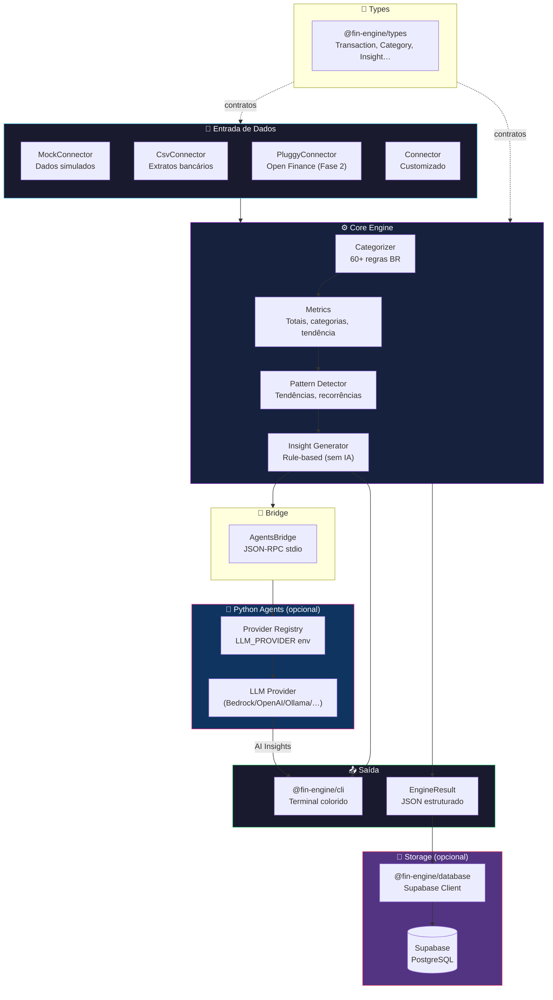
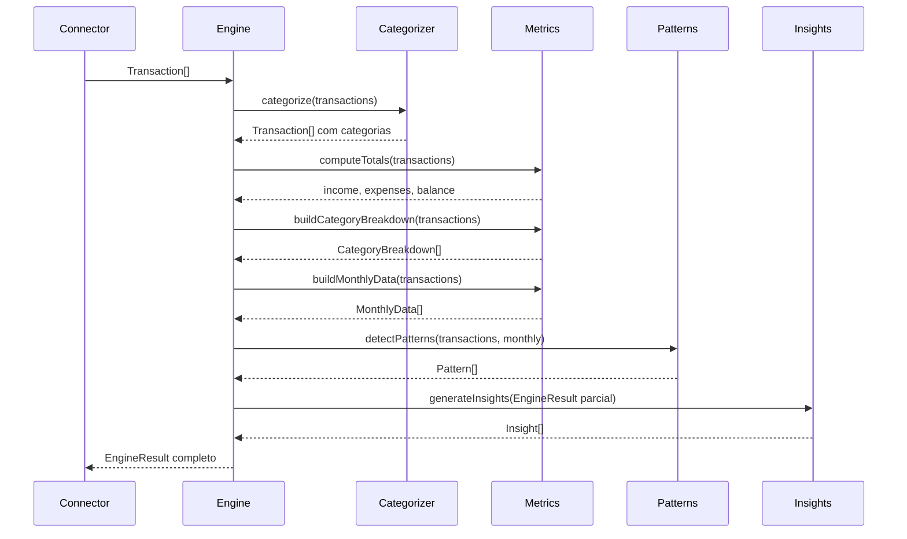
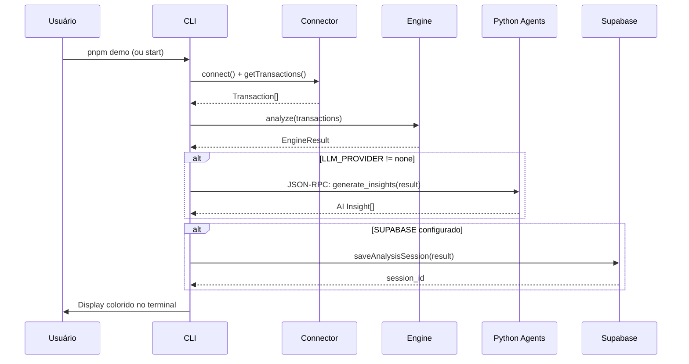
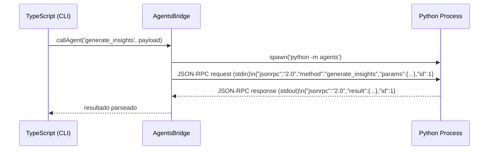
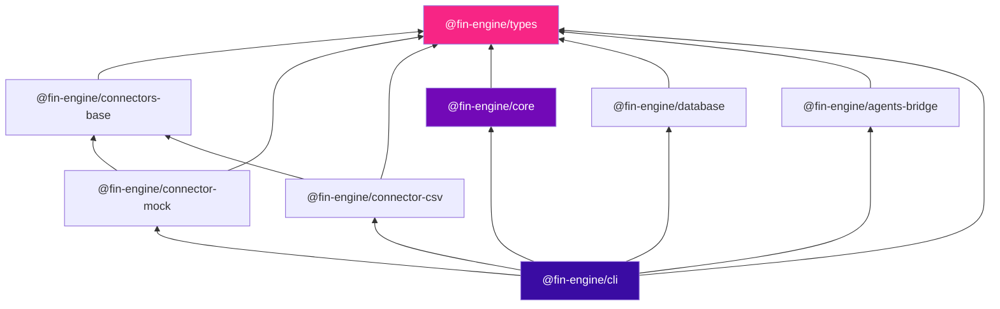

# 02 — Arquitetura

> **Design e estrutura do FinEngine OSS.**

**Navegação:** [← Getting Started](01-getting-started.md) | [Packages →](03-packages.md)

---

## Índice

- [Visão geral](#visão-geral)
- [Diagrama de alto nível](#diagrama-de-alto-nível)
- [Camadas do sistema](#camadas-do-sistema)
- [Fluxo de dados](#fluxo-de-dados)
- [Comunicação TS↔Python](#comunicação-tspython)
- [Dependências entre packages](#dependências-entre-packages)
- [Decisões de design](#decisões-de-design)

---

## Visão geral

O FinEngine é um **monorepo híbrido** (TypeScript + Python) organizado em camadas:

```
Entrada → Connectors → Core Engine → Agents (IA) → Saída
                           ↓
                        Storage
```

**Princípios:**
- **Local-first** — dados na sua máquina, sem telemetria
- **Provider-agnostic** — qualquer LLM, zero lock-in
- **Plugável** — connectors e agents são plugins independentes
- **Sem IA obrigatória** — funciona completo sem qualquer provider configurado

---

## Diagrama de alto nível



---

## Camadas do sistema

### Camada 1 — Types (`@fin-engine/types`)

Base de tudo. Define os contratos de dados que fluem pelo sistema:

```typescript
interface Transaction {
  id: string
  date: string          // ISO: "2024-01-15"
  description: string
  amount: number        // positivo = receita, negativo = despesa
  type: 'credit' | 'debit'
  category: Category
  source: string
  metadata?: Record<string, unknown>
}

type Category =
  | 'income' | 'housing' | 'food' | 'transport'
  | 'health' | 'education' | 'entertainment'
  | 'shopping' | 'utilities' | 'investment'
  | 'transfer' | 'fee' | 'other'
```

### Camada 2 — Connectors

Responsáveis por **buscar transações** de qualquer fonte:

```typescript
interface Connector {
  readonly name: string
  connect(): Promise<void>
  getTransactions(): Promise<Transaction[]>
}
```

Cada connector é um pacote independente (`@fin-engine/connector-*`).

### Camada 3 — Core Engine

O coração do sistema. Recebe `Transaction[]` e produz `EngineResult`:

```typescript
interface EngineResult {
  period: Period
  transactions: Transaction[]
  totalIncome: number
  totalExpenses: number
  balance: number
  savingsRate: number
  categoryBreakdown: CategoryBreakdown[]
  monthly: MonthlyData[]
  patterns: Pattern[]
  insights: Insight[]
}
```

Pipeline interno:



### Camada 4 — AI Agents (Python, opcional)

Sidecar Python que enriquece insights usando LLMs. Comunicação via JSON-RPC sobre stdio.

Veja: [06-ai-agents.md](06-ai-agents.md)

### Camada 5 — Storage (opcional)

Cliente Supabase para persistir análises. Veja: [07-database-supabase.md](07-database-supabase.md)

---

## Fluxo de dados



---

## Comunicação TS↔Python

O sidecar Python é iniciado como subprocesso pelo `AgentsBridge`:



**Protocolo:** [JSON-RPC 2.0](https://www.jsonrpc.org/specification) sobre stdio.

**Por que stdio?**
- Zero overhead de rede
- Sem autenticação necessária
- Funciona em qualquer OS
- Simples de debugar (você pode ver o JSON direto)

---

## Dependências entre packages



O `types` é a única dependência de **todos** os outros packages — garante consistência de contratos.

---

## Decisões de design

### Por que TypeScript + Python?

| Aspecto | TypeScript | Python |
|---|---|---|
| CLI, I/O, parsing | ✅ Ecossistema excelente | ❌ Menos adequado |
| LLMs (Bedrock, OpenAI) | SDKs existem mas Python é padrão | ✅ Primeiro suporte |
| Data science futura | Funcional mas não ideal | ✅ NumPy, Pandas, OpenBB |
| Performance de build | tsup (esbuild) muito rápido | — |

### Por que pnpm + Turborepo?

- **pnpm**: hard links economizam disco; workspaces nativos
- **Turborepo**: cache inteligente de builds (se types não mudou, não reconstrói)
- **Alternativas consideradas**: Nx (mais pesado), Lerna (legado), yarn workspaces (sem cache)

### Por que JSON-RPC sobre stdio?

- **Alternativa HTTP**: requer gerenciamento de porta, mais latência, mais complexidade
- **Alternativa gRPC**: proto files, boilerplate, difícil de debugar
- **stdio**: sem servidor, sem portas, uma linha para matar (`process.kill(pid)`)

### Por que Supabase?

- PostgreSQL gerenciado com SDK TypeScript nativo
- Row Level Security built-in (fácil de configurar para single-user)
- Supabase CLI para migrations
- **Alternativa DuckDB**: ótimo para análise local mas sem sync remoto

---

**Navegação:** [← Getting Started](01-getting-started.md) | [Packages →](03-packages.md)
