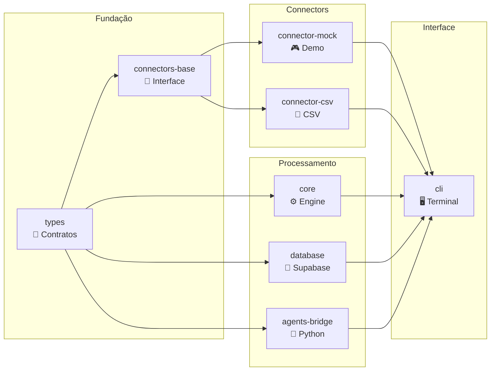

# 03 — Packages

> **O que cada pacote faz, suas exports públicas e como usá-los.**

**Navegação:** [← Arquitetura](02-architecture.md) | [Connectors →](04-connectors.md)

---

## Índice

- [Visão geral](#visão-geral)
- [@fin-engine/types](#fin-enginetypes)
- [@fin-engine/connectors-base](#fin-engineconnectors-base)
- [@fin-engine/connector-mock](#fin-engineconnector-mock)
- [@fin-engine/connector-csv](#fin-engineconnector-csv)
- [@fin-engine/core](#fin-enginecore)
- [@fin-engine/database](#fin-enginedatabase)
- [@fin-engine/agents-bridge](#fin-engineagents-bridge)
- [@fin-engine/cli](#fin-enginecli)

---

## Visão geral



---

## @fin-engine/types

**Localização:** `packages/types/`

O pacote mais fundamental do monorepo. Define todos os tipos TypeScript compartilhados — é o contrato entre connectors, engine e output.

### Tipos exportados

```typescript
// Categorias disponíveis (13 total)
type Category =
  | 'income'        // Receitas, salários, rendimentos
  | 'housing'       // Aluguel, condomínio, IPTU
  | 'food'          // Supermercados, restaurantes, delivery
  | 'transport'     // Combustível, Uber, transporte público
  | 'health'        // Farmácia, médico, academia
  | 'education'     // Cursos, livros, escola
  | 'entertainment' // Netflix, Spotify, shows
  | 'shopping'      // Roupas, eletrônicos, Amazon
  | 'utilities'     // Água, luz, internet, telefone
  | 'investment'    // Tesouro Direto, CDB, ações
  | 'transfer'      // PIX, TED, transferências
  | 'fee'           // Tarifas bancárias
  | 'other'         // Não classificado

// Transação financeira
interface Transaction {
  id: string
  date: string          // "YYYY-MM-DD"
  description: string
  amount: number        // + = receita, - = despesa
  type: 'credit' | 'debit'
  category: Category
  source: string        // nome do connector
  metadata?: Record<string, unknown>
}

// Período de análise
interface Period {
  from: string          // "YYYY-MM-DD"
  to: string
  days: number
}

// Resultado de análise por categoria
interface CategoryBreakdown {
  category: Category
  total: number
  count: number
  percentage: number    // % das despesas totais
  transactions: Transaction[]
}

// Dados mensais agregados
interface MonthlyData {
  month: string         // "2024-01"
  income: number
  expenses: number
  balance: number
  savingsRate: number
}

// Padrão detectado
interface Pattern {
  type: 'high_spending' | 'spending_increase' | 'recurring' | 'low_savings'
  category?: Category
  description: string
  value?: number
  changePercent?: number
}

// Insight gerado
interface Insight {
  id: string
  level: 'info' | 'warning' | 'alert'
  message: string
  detail?: string
  category?: Category
  value?: number
  changePercent?: number
}

// Resultado completo da análise
interface EngineResult {
  period: Period
  transactions: Transaction[]
  totalIncome: number
  totalExpenses: number
  balance: number
  savingsRate: number
  categoryBreakdown: CategoryBreakdown[]
  monthly: MonthlyData[]
  patterns: Pattern[]
  insights: Insight[]
}
```

### Como usar

```typescript
import type { Transaction, Category, EngineResult } from '@fin-engine/types'
```

---

## @fin-engine/connectors-base

**Localização:** `packages/connectors-base/`

Fornece a classe base abstrata para todos os connectors.

### Interface pública

```typescript
import { BaseConnector } from '@fin-engine/connectors-base'
import type { Connector } from '@fin-engine/types'

// BaseConnector implementa Connector
abstract class BaseConnector implements Connector {
  abstract readonly name: string

  // Implementação no-op — override se precisar autenticar
  async connect(): Promise<void> {}

  // Deve retornar transações
  abstract getTransactions(): Promise<Transaction[]>
}
```

### Como usar

```typescript
import { BaseConnector } from '@fin-engine/connectors-base'

export class MeuConnector extends BaseConnector {
  readonly name = 'meu-connector'

  async getTransactions() {
    return [] // sua implementação
  }
}
```

---

## @fin-engine/connector-mock

**Localização:** `packages/connector-mock/`

Gera dados financeiros simulados realistas (90 dias, mercado brasileiro).

### Interface pública

```typescript
import { MockConnector } from '@fin-engine/connector-mock'

const connector = new MockConnector()
await connector.connect()
const transactions = await connector.getTransactions()
// → Transaction[] com ~126 transações
```

### Dados gerados

- **Período:** últimos 90 dias
- **Volume:** ~126 transações
- **Categorias:** todas as 13 categorias representadas
- **Valores:** baseados em renda de ~R$ 8.700/mês
- **Padrão embutido:** alimentação aumenta 35% nos últimos 30 dias (para testar detecção)

Fonte dos dados: [`packages/connector-mock/src/data.ts`](../packages/connector-mock/src/data.ts)

---

## @fin-engine/connector-csv

**Localização:** `packages/connector-csv/`

Importa transações de qualquer arquivo CSV com auto-detecção de formato.

### Interface pública

```typescript
import { CsvConnector } from '@fin-engine/connector-csv'

const connector = new CsvConnector('./extrato.csv')
await connector.connect()   // verifica se arquivo existe
const transactions = await connector.getTransactions()  // parseia CSV
```

### Formatos suportados

```typescript
// Auto-detecta estas colunas (PT e EN):
const COLUMN_ALIASES = {
  date: ['date', 'data', 'dt', 'fecha'],
  description: ['description', 'descricao', 'historico', 'memo', 'label'],
  amount: ['amount', 'valor', 'value', 'quantia'],
  type: ['type', 'tipo'],
  category: ['category', 'categoria'],
}

// Formatos de número aceitos:
// "1234.56", "1.234,56", "-R$ 250,00", "R$ -250,00"
```

### Exemplos de CSV válidos

**Formato 1 — Colunas em inglês:**
```csv
date,description,amount,type
2024-01-05,Salary,8000.00,credit
2024-01-07,Rent,-2500.00,debit
```

**Formato 2 — Colunas em português:**
```csv
data,historico,valor,tipo
05/01/2024,Salário,8000.00,credito
07/01/2024,Aluguel,-2500.00,debito
```

**Formato 3 — Com separador de milhares BR:**
```csv
data,descricao,valor
2024-01-12,Supermercado Carrefour,"-1.287,50"
```

---

## @fin-engine/core

**Localização:** `packages/core/`

O coração do sistema. Recebe transações e produz análise financeira completa.

### Interface pública

```typescript
import { FinancialEngine } from '@fin-engine/core'

const engine = new FinancialEngine()
const result: EngineResult = engine.analyze(transactions)
```

### FinancialEngine

```typescript
class FinancialEngine {
  analyze(transactions: Transaction[]): EngineResult
}
```

O método `analyze()` executa o pipeline completo:

1. **Categorização automática** das transações sem categoria
2. **Cálculo de totais** (receitas, despesas, saldo, poupança)
3. **Breakdown por categoria** com percentuais
4. **Período** (datas min/max, dias)
5. **Dados mensais** agregados
6. **Detecção de padrões** (tendências, recorrências)
7. **Geração de insights** rule-based

### Categorizer

```typescript
import { categorize, categorizeAll } from '@fin-engine/core'

// Categorizar uma transação
const category = categorize('Supermercado Carrefour')
// → 'food'

// Categorizar array de transações
const categorized = categorizeAll(transactions)
```

### Metrics

```typescript
import {
  buildMonthlyData,
  buildCategoryBreakdown,
  detectPatterns,
  calcPeriod,
} from '@fin-engine/core'
```

---

## @fin-engine/database

**Localização:** `packages/database/`

Cliente Supabase com queries tipadas para persistir análises.

> Requer `SUPABASE_URL` e `SUPABASE_ANON_KEY` no `.env`.

### Interface pública

```typescript
import {
  getClient,
  isConfigured,
  saveTransactions,
  getTransactions,
  saveAnalysisSession,
  getAnalysisSessions,
  getAnalysisSession,
  saveInsights,
} from '@fin-engine/database'

// Verificar se Supabase está configurado
if (isConfigured()) {
  // Salvar uma sessão de análise
  const session = await saveAnalysisSession({
    sourceConnector: 'csv',
    result: engineResult,
  })

  // Salvar transações da sessão
  await saveTransactions(transactions, session.id)

  // Salvar insights
  await saveInsights(insights, session.id)
}

// Buscar histórico
const sessions = await getAnalysisSessions(10)  // últimas 10
const session = await getAnalysisSession(sessionId)
```

---

## @fin-engine/agents-bridge

**Localização:** `packages/agents-bridge/` _(Fase 3)_

Bridge TypeScript↔Python para comunicação com o sidecar de IA via JSON-RPC stdio.

```typescript
import { AgentsBridge } from '@fin-engine/agents-bridge'

const bridge = new AgentsBridge()
const aiInsights = await bridge.generateInsights(engineResult)
// Internamente: spawn python -m agents, JSON-RPC via stdio
```

---

## @fin-engine/cli

**Localização:** `packages/cli/`

Interface de linha de comando com terminal colorido e interativo.

### Comandos disponíveis

```bash
fin-engine demo    # Executa análise com dados simulados
fin-engine start   # Menu interativo
fin-engine --help  # Ajuda
fin-engine --version
```

### Dependências externas

| Pacote | Uso |
|---|---|
| `commander` | Parse de argumentos CLI |
| `chalk` | Cores no terminal |
| `ora` | Spinners de loading |
| `@inquirer/prompts` | Menu interativo |
| `boxen` | Caixas decorativas |

Referência completa: [09-cli-reference.md](09-cli-reference.md)

---

**Navegação:** [← Arquitetura](02-architecture.md) | [Connectors →](04-connectors.md)
