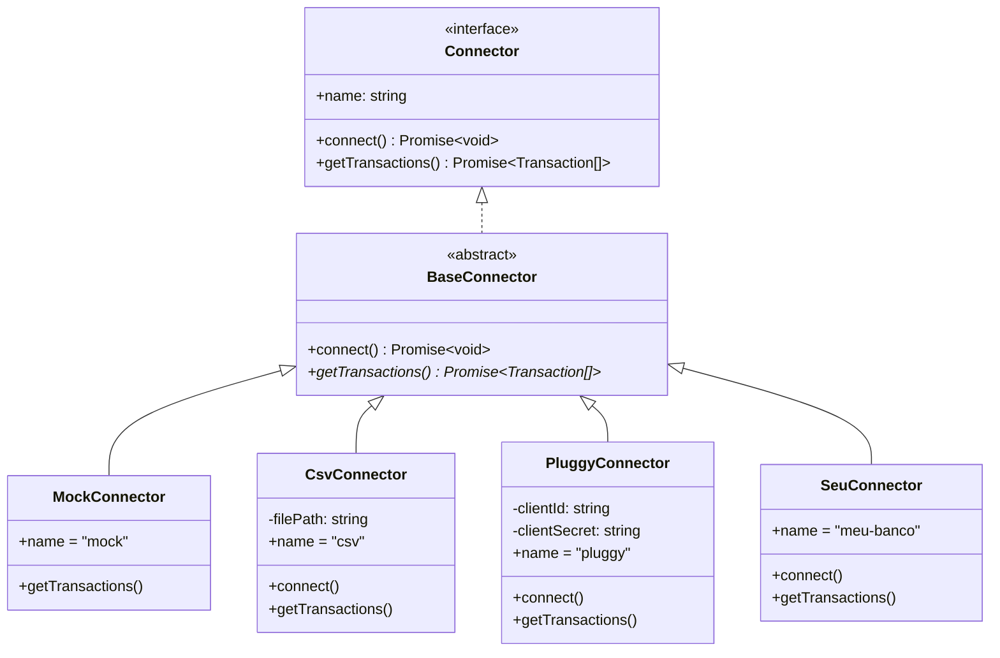

# 04 — Connectors

> **Como conectar fontes de dados ao FinEngine — usando os existentes e criando os seus.**

**Navegação:** [← Packages](03-packages.md) | [Core Engine →](05-core-engine.md)

---

## Índice

- [O que é um Connector?](#o-que-é-um-connector)
- [Connectors disponíveis](#connectors-disponíveis)
- [Usando o MockConnector](#usando-o-mockconnector)
- [Usando o CsvConnector](#usando-o-csvconnector)
- [Pluggy Connector (Fase 2)](#pluggy-connector-fase-2)
- [Criar um Connector customizado](#criar-um-connector-customizado)
- [Testando seu connector](#testando-seu-connector)

---

## O que é um Connector?

Um Connector é qualquer classe que sabe **buscar transações financeiras** de uma fonte específica (banco, CSV, API, banco de dados).

Todos os connectors implementam a mesma interface:

```typescript
interface Connector {
  readonly name: string          // identificador do connector
  connect(): Promise<void>       // autenticação/inicialização
  getTransactions(): Promise<Transaction[]>  // buscar transações
}
```



---

## Connectors disponíveis

| Connector | Package | Status | Custo | Casos de uso |
|---|---|---|---|---|
| **Mock** | `@fin-engine/connector-mock` | ✅ | Grátis | Demo, desenvolvimento, testes |
| **CSV** | `@fin-engine/connector-csv` | ✅ | Grátis | Qualquer extrato bancário exportado |
| **Pluggy** | `@fin-engine/connector-pluggy` | 🔧 Fase 2 | Sandbox grátis | Open Finance, +300 bancos BR ao vivo |

---

## Usando o MockConnector

```typescript
import { MockConnector } from '@fin-engine/connector-mock'
import { FinancialEngine } from '@fin-engine/core'

const connector = new MockConnector()
await connector.connect()
const transactions = await connector.getTransactions()

const engine = new FinancialEngine()
const result = engine.analyze(transactions)
```

Sem configuração. Ideal para:
- Demonstrações
- Desenvolvimento local
- Testes de integração

---

## Usando o CsvConnector

### Exportar extrato do seu banco

| Banco | Como exportar |
|---|---|
| Nubank | App → Perfil → Exportar transações |
| Inter | App → Extrato → Exportar CSV |
| Bradesco | Internet Banking → Extrato → CSV |
| Itaú | Internet Banking → Extrato → Formato CSV |
| Santander | Internet Banking → Extrato → Exportar |
| C6 Bank | App → Extrato → Compartilhar como CSV |

> Cada banco tem um formato diferente — o CsvConnector detecta automaticamente o formato.

### Importar

```typescript
import { CsvConnector } from '@fin-engine/connector-csv'
import { FinancialEngine } from '@fin-engine/core'

const connector = new CsvConnector('./extrato-nubank.csv')
await connector.connect()  // verifica se arquivo existe
const transactions = await connector.getTransactions()
```

### Colunas reconhecidas automaticamente

```typescript
const COLUMN_MAP = {
  date:        ['date', 'data', 'dt', 'fecha', 'Data'],
  description: ['description', 'descricao', 'historico',
                'memo', 'label', 'Descrição', 'Histórico'],
  amount:      ['amount', 'valor', 'value', 'quantia',
                'Valor', 'Montante'],
  type:        ['type', 'tipo', 'Tipo'],
  category:    ['category', 'categoria', 'Categoria'],
}
```

### Formatos de data aceitos

```
2024-01-15           (ISO padrão)
15/01/2024           (BR padrão)
01/15/2024           (US)
15-01-2024
Jan 15, 2024
```

### Formatos de valor aceitos

```
1234.56              sem separadores
1,234.56             US com vírgula como separador de milhar
1.234,56             BR com ponto como separador de milhar
-1.234,56            negativo
R$ -1.234,56         com símbolo de moeda
"R$ 1.234,56"        entre aspas (como Bradesco exporta)
```

### CSV de exemplo

Veja [`examples/sample.csv`](../examples/sample.csv) para um exemplo completo com 3 meses de dados.

---

## Pluggy Connector (Fase 2)

> **Disponível na Fase 2 do roadmap.**

O Pluggy é uma plataforma de Open Finance que conecta com +300 bancos brasileiros, permitindo buscar transações em tempo real.

### Pré-requisitos (quando disponível)

1. Cadastro em [pluggy.ai](https://pluggy.ai)
2. Criar uma aplicação (sandbox grátis)
3. Obter `CLIENT_ID` e `CLIENT_SECRET`

```env
PLUGGY_CLIENT_ID=seu-client-id
PLUGGY_CLIENT_SECRET=seu-client-secret
```

### Uso esperado (Fase 2)

```typescript
import { PluggyConnector } from '@fin-engine/connector-pluggy'

const connector = new PluggyConnector({
  clientId: process.env.PLUGGY_CLIENT_ID!,
  clientSecret: process.env.PLUGGY_CLIENT_SECRET!,
})

await connector.connect()  // autenticação OAuth
const transactions = await connector.getTransactions()
```

---

## Criar um Connector customizado

Você pode criar connectors para qualquer fonte: outra API, banco de dados local, Excel (via lib), scraping, etc.

### Passo 1: Criar o pacote

```bash
mkdir packages/connector-meu-banco
cd packages/connector-meu-banco
```

**`package.json`:**
```json
{
  "name": "@fin-engine/connector-meu-banco",
  "version": "0.1.0",
  "type": "module",
  "main": "./dist/index.js",
  "types": "./dist/index.d.ts",
  "scripts": {
    "build": "tsup src/index.ts --format esm --dts",
    "dev": "tsup src/index.ts --format esm --dts --watch"
  },
  "dependencies": {
    "@fin-engine/connectors-base": "workspace:*",
    "@fin-engine/types": "workspace:*"
  }
}
```

### Passo 2: Implementar

**`src/index.ts`:**
```typescript
import { BaseConnector } from '@fin-engine/connectors-base'
import type { Transaction, Category } from '@fin-engine/types'

interface MeuBancoTransaction {
  // formato da API/CSV do seu banco
  data: string
  descricao: string
  valor: number
}

export class MeuBancoConnector extends BaseConnector {
  readonly name = 'meu-banco'

  private apiKey: string

  constructor(apiKey: string) {
    super()
    this.apiKey = apiKey
  }

  override async connect(): Promise<void> {
    // verificar credenciais, autenticar, etc.
  }

  async getTransactions(): Promise<Transaction[]> {
    // buscar transações da fonte
    const raw: MeuBancoTransaction[] = await this.fetchFromApi()

    // converter para o formato padrão
    return raw.map((t) => this.normalize(t))
  }

  private async fetchFromApi(): Promise<MeuBancoTransaction[]> {
    // lógica de chamada à API
    return []
  }

  private normalize(t: MeuBancoTransaction): Transaction {
    return {
      id: `meu-banco-${t.data}-${Math.random()}`,
      date: t.data,
      description: t.descricao,
      amount: t.valor,
      type: t.valor >= 0 ? 'credit' : 'debit',
      category: 'other',  // o engine categoriza automaticamente
      source: this.name,
    }
  }
}
```

### Passo 3: Adicionar ao workspace

**`pnpm-workspace.yaml`** já inclui `packages/*`, então o pacote é detectado automaticamente.

```bash
pnpm install
pnpm build --filter @fin-engine/connector-meu-banco
```

### Passo 4: Usar na CLI

Adicione o connector à lista de opções em `packages/cli/src/commands/start.ts`:

```typescript
import { MeuBancoConnector } from '@fin-engine/connector-meu-banco'

// No menu de seleção de fonte:
const connectors = {
  'mock': () => new MockConnector(),
  'csv': (path: string) => new CsvConnector(path),
  'meu-banco': () => new MeuBancoConnector(process.env.MEU_BANCO_API_KEY!),
}
```

---

## Testando seu connector

```typescript
// packages/connector-meu-banco/src/index.test.ts
import { describe, it, expect } from 'vitest'
import { MeuBancoConnector } from './index.js'

describe('MeuBancoConnector', () => {
  it('deve retornar transações válidas', async () => {
    const connector = new MeuBancoConnector('test-key')
    await connector.connect()
    const transactions = await connector.getTransactions()

    expect(Array.isArray(transactions)).toBe(true)

    for (const t of transactions) {
      expect(t.id).toBeDefined()
      expect(t.date).toMatch(/\d{4}-\d{2}-\d{2}/)
      expect(typeof t.amount).toBe('number')
      expect(t.source).toBe('meu-banco')
    }
  })
})
```

```bash
pnpm test --filter @fin-engine/connector-meu-banco
```

---

**Navegação:** [← Packages](03-packages.md) | [Core Engine →](05-core-engine.md)
