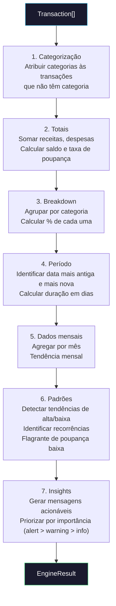
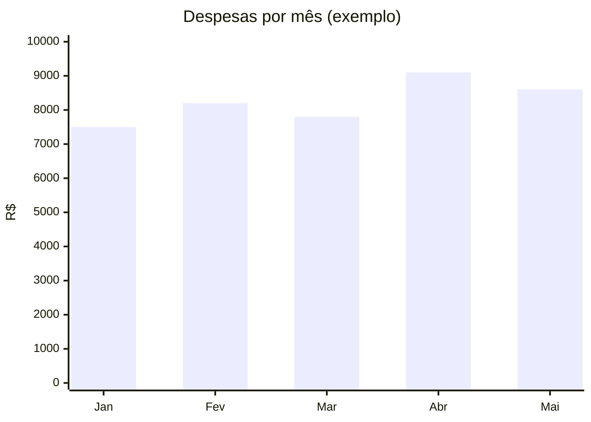
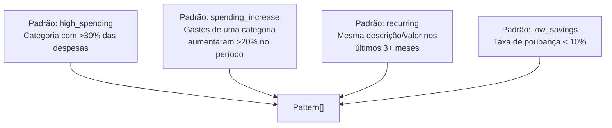

# 05 — Core Engine

> **Como o motor de análise financeira funciona: categorização, métricas, padrões e insights.**

**Navegação:** [← Connectors](04-connectors.md) | [AI Agents →](06-ai-agents.md)

---

## Índice

- [Visão geral](#visão-geral)
- [Pipeline de análise](#pipeline-de-análise)
- [Categorização](#categorização)
- [Métricas](#métricas)
- [Detecção de padrões](#detecção-de-padrões)
- [Geração de insights](#geração-de-insights)
- [API pública](#api-pública)

---

## Visão geral

O `@fin-engine/core` transforma uma lista de transações brutas em uma análise financeira estruturada:

```
Transaction[] → FinancialEngine.analyze() → EngineResult
```

O `EngineResult` contém tudo que você precisa para tomar decisões financeiras:

```typescript
interface EngineResult {
  period: Period              // período coberto
  transactions: Transaction[] // transações (categorizadas)
  totalIncome: number
  totalExpenses: number
  balance: number
  savingsRate: number         // % da receita economizada
  categoryBreakdown: CategoryBreakdown[]  // gastos por categoria
  monthly: MonthlyData[]      // evolução mês a mês
  patterns: Pattern[]         // padrões detectados
  insights: Insight[]         // insights e alertas
}
```

---

## Pipeline de análise



---

## Categorização

**Arquivo:** `packages/core/src/categorizer.ts`

O categorizador usa **regex rules** para inferir a categoria a partir da descrição da transação.

### Como funciona

```typescript
function categorize(description: string): Category {
  const desc = description.toLowerCase().normalize('NFD')

  for (const rule of RULES) {
    if (rule.pattern.test(desc)) {
      return rule.category
    }
  }

  return 'other'
}
```

As regras são testadas em ordem de prioridade — a primeira que bater vence.

### Regras por categoria

**`income`** — Receitas
```
salario, salário, pagamento, renda, freelance, pix recebido,
transferencia recebida, deposito, rendimento, dividendo, juros
```

**`housing`** — Moradia
```
aluguel, condominio, condomínio, iptu, agua, energia, luz,
copasa, cemig, sabesp, cedae
```

**`food`** — Alimentação
```
supermercado, mercado, carrefour, extra, pao de acucar,
ifood, rappi, uber eats, restaurante, lanchonete,
mc donalds, mcdonalds, burger king, subway, starbucks,
padaria, açougue, hortifruti
```

**`transport`** — Transporte
```
uber, 99, cabify, taxi, combustivel, gasolina, etanol,
posto, shell, br distribuidora, bilhete unico, metro,
onibus, trem, companhia paulistana, pedagio
```

**`health`** — Saúde
```
farmacia, drogaria, droga raia, ultrafarma, medico,
hospital, clinica, plano de saude, unimed, bradesco saude,
sulamerica, amil, academia, smartfit, bodytech
```

**`entertainment`** — Lazer
```
netflix, spotify, amazon prime, hbo, disney,
youtube premium, twitch, steam, playstation, xbox
```

**`utilities`** — Utilidades
```
claro, vivo, tim, oi, nextel, internet, telefone,
net virtua, sky, directv
```

**`investment`** — Investimentos
```
tesouro direto, cdb, lci, lca, fii, xp investimentos,
rico, clear, nuinvest, ativo, b3
```

### Adicionar novas regras

Edite `packages/core/src/categorizer.ts`:

```typescript
// Adicione ao array RULES, antes da regra 'other'
{
  pattern: /minha.*empresa|minha.*loja/i,
  category: 'shopping' as Category,
},
```

> As regras são testadas em ordem — coloque as mais específicas primeiro.

### Prioridade de categorização

1. Se a transação já tem `category` diferente de `'other'`, é mantida
2. Senão, as regras são testadas em sequência
3. Fallback: `'other'`

---

## Métricas

**Arquivo:** `packages/core/src/metrics.ts`

### Totais

```typescript
function computeTotals(transactions: Transaction[]) {
  const totalIncome = transactions
    .filter(t => t.amount > 0)
    .reduce((sum, t) => sum + t.amount, 0)

  const totalExpenses = Math.abs(
    transactions
      .filter(t => t.amount < 0)
      .reduce((sum, t) => sum + t.amount, 0)
  )

  const balance = totalIncome - totalExpenses
  const savingsRate = totalIncome > 0
    ? (balance / totalIncome) * 100
    : 0

  return { totalIncome, totalExpenses, balance, savingsRate }
}
```

### Breakdown por categoria

Agrupa despesas (valores negativos) por categoria:

```
Moradia:      R$ 9.000  →  36.8% das despesas
Alimentação:  R$ 6.057  →  24.7%
...
```

Transações de `income` e `investment` são excluídas do breakdown de despesas.

### Dados mensais

Agrega transações por mês (`YYYY-MM`), calculando receitas, despesas e saldo para cada mês.



### Taxa de poupança

$$\text{savingsRate} = \frac{\text{totalIncome} - \text{totalExpenses}}{\text{totalIncome}} \times 100$$

A meta recomendada é ≥ 20%. Abaixo de 10% gera alerta.

---

## Detecção de padrões

**Arquivo:** `packages/core/src/metrics.ts` — função `detectPatterns()`



### `high_spending`

Detecta quando uma categoria representa mais de 30% das despesas totais:

```typescript
if (breakdown.percentage > 30) {
  patterns.push({
    type: 'high_spending',
    category: breakdown.category,
    description: `Gastos com ${label} representam ${pct}% das despesas`,
    value: breakdown.total,
  })
}
```

### `spending_increase`

Compara os gastos dos últimos 30 dias com os 30 dias anteriores:

```typescript
// Se alimentação: R$ 3.000 (últimos 30d) vs R$ 2.000 (30d antes)
// → changePercent = +50%
```

### `recurring`

Detecta assinaturas e pagamentos recorrentes procurando transações com descrições similares nos últimos 3+ meses.

### `low_savings`

Verifica se `savingsRate < 10`.

---

## Geração de insights

**Arquivo:** `packages/core/src/engine.ts` — função `generateInsights()`

Os insights são mensagens acionáveis geradas a partir dos padrões e métricas:

```typescript
interface Insight {
  id: string
  level: 'info' | 'warning' | 'alert'
  message: string
  detail?: string
  category?: Category
  value?: number
  changePercent?: number
}
```

### Exemplos de insights gerados

| Level | Condição | Mensagem |
|---|---|---|
| `alert` | savingsRate < 10% | "Taxa de poupança muito baixa: 6.9%" |
| `warning` | spending_increase > 20% | "Gastos com alimentação aumentaram 35% no período" |
| `info` | recurring detectado | "Assinatura recorrente: Netflix — R$ 55,90/mês" |
| `warning` | high_spending > 40% | "Moradia representa 45% das despesas totais" |
| `info` | balance > 0 | "Saldo positivo: você está dentro do orçamento" |

Os insights são ordenados por `level`: alertas primeiro, depois warnings, depois infos.

---

## API pública

### FinancialEngine

```typescript
import { FinancialEngine } from '@fin-engine/core'

const engine = new FinancialEngine()
const result = engine.analyze(transactions)
```

### Funções individuais

```typescript
import {
  categorize,           // categoriza uma transação
  categorizeAll,        // categoriza array de transações
  buildMonthlyData,     // agrega por mês
  buildCategoryBreakdown, // breakdown por categoria
  detectPatterns,       // detecta padrões
  calcPeriod,           // calcula período (from, to, days)
} from '@fin-engine/core'
```

---

**Navegação:** [← Connectors](04-connectors.md) | [AI Agents →](06-ai-agents.md)
