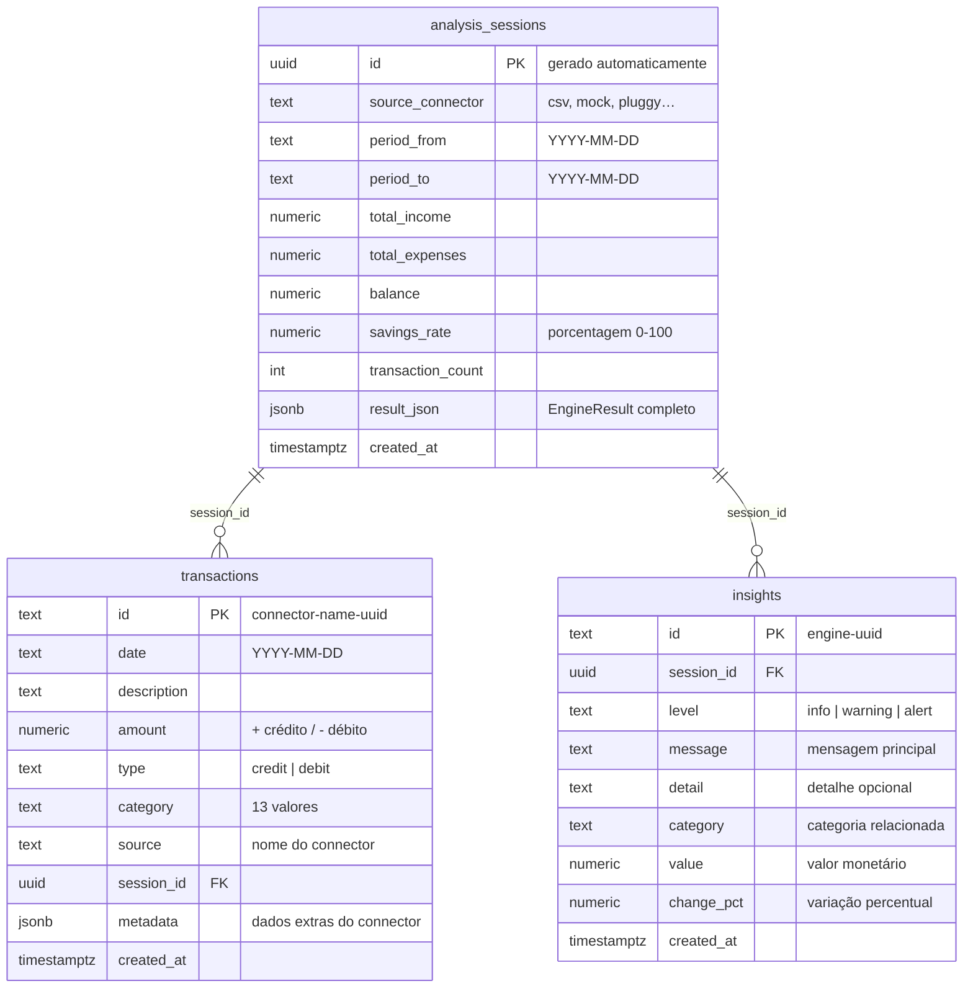

# 07 — Database / Supabase

> **Como configurar o Supabase, executar as migrations e usar as queries tipadas.**

**Navegação:** [← AI Agents](06-ai-agents.md) | [Docker →](08-docker.md)

---

## Índice

- [Por que Supabase?](#por-que-supabase)
- [Setup em 3 passos](#setup-em-3-passos)
- [Schema do banco](#schema-do-banco)
- [Migrations](#migrations)
- [API TypeScript](#api-typescript)
- [Queries de exemplo](#queries-de-exemplo)
- [Row Level Security](#row-level-security)
- [Views disponíveis](#views-disponíveis)

---

## Por que Supabase?

O FinEngine usa **Supabase** (PostgreSQL gerenciado) para:
- Salvar histórico de análises
- Persistir transações importadas
- Consultar análises anteriores
- Comparar evolução financeira ao longo do tempo

**O Supabase é completamente opcional.** Sem ele, o FinEngine funciona normalmente — apenas sem persistência.

### Vantagens

- **PostgreSQL** — banco relacional robusto, não um banco de nicho
- **Tier gratuito** — generoso para uso pessoal (500 MB storage, 2 projetos)
- **SDK TypeScript nativo** — `@supabase/supabase-js` com tipos gerados
- **RLS built-in** — segurança por linha sem necessidade de servidor extra
- **SQL Editor** — execute queries diretamente no dashboard

---

## Setup em 3 passos

### 1. Criar projeto no Supabase

1. Acesse [app.supabase.com](https://app.supabase.com)
2. Clique em **New Project**
3. Escolha um nome, senha do banco e região (preferência: São Paulo ou EUA Leste)
4. Aguarde a criação (~2 min)

### 2. Executar a migration

No Supabase Dashboard:
1. Vá em **SQL Editor** → **New Query**
2. Cole o conteúdo completo de [`packages/database/migrations/001_initial.sql`](../packages/database/migrations/001_initial.sql)
3. Clique em **Run**

Você verá as tabelas criadas em **Table Editor**.

### 3. Configurar as credenciais

No Supabase Dashboard → **Project Settings** → **API**:

```env
# .env
SUPABASE_URL=https://XXXXXXXXXXXXXXXX.supabase.co
SUPABASE_ANON_KEY=eyJhbGciOiJIUzI1NiIsInR5cCI6IkpXVCJ9...
```

> Use a chave **`anon public`** — não a `service_role`. A anon key é segura para uso local.

---

## Schema do banco



### Tabela `analysis_sessions`

Cada execução de `engine.analyze()` gera uma sessão.

| Coluna | Tipo | Descrição |
|---|---|---|
| `id` | UUID | Gerado automaticamente |
| `source_connector` | text | Nome do connector usado (csv, mock…) |
| `period_from` | text | Data da transação mais antiga |
| `period_to` | text | Data da transação mais recente |
| `total_income` | numeric | Total de receitas |
| `total_expenses` | numeric | Total de despesas |
| `balance` | numeric | Saldo (income - expenses) |
| `savings_rate` | numeric | Percentual poupado |
| `transaction_count` | int | Número de transações |
| `result_json` | jsonb | EngineResult completo em JSON |
| `created_at` | timestamptz | Data/hora da análise |

### Tabela `transactions`

Cópia das transações associadas a uma sessão.

### Tabela `insights`

Insights gerados durante a análise (rule-based e/ou AI).

---

## Migrations

As migrations estão em `packages/database/migrations/`.

**`001_initial.sql`** — Schema inicial:
```sql
-- Habilita UUID
CREATE EXTENSION IF NOT EXISTS "uuid-ossp";

-- Tabela de sessões de análise
CREATE TABLE IF NOT EXISTS analysis_sessions (
  id uuid DEFAULT uuid_generate_v4() PRIMARY KEY,
  source_connector text NOT NULL,
  period_from text,
  period_to text,
  total_income numeric DEFAULT 0,
  total_expenses numeric DEFAULT 0,
  balance numeric DEFAULT 0,
  savings_rate numeric DEFAULT 0,
  transaction_count int DEFAULT 0,
  result_json jsonb,
  created_at timestamptz DEFAULT now()
);

-- Tabela de transações
CREATE TABLE IF NOT EXISTS transactions (
  id text PRIMARY KEY,
  date text NOT NULL,
  description text NOT NULL,
  amount numeric NOT NULL,
  type text NOT NULL,
  category text NOT NULL,
  source text NOT NULL,
  session_id uuid REFERENCES analysis_sessions(id),
  metadata jsonb DEFAULT '{}',
  created_at timestamptz DEFAULT now()
);

-- Tabela de insights
CREATE TABLE IF NOT EXISTS insights ( ... );

-- Row Level Security (acesso anon total — single-user local tool)
ALTER TABLE analysis_sessions ENABLE ROW LEVEL SECURITY;
CREATE POLICY "anon_all" ON analysis_sessions FOR ALL TO anon USING (true);
-- (similar para transactions e insights)
```

Veja o arquivo completo: [`packages/database/migrations/001_initial.sql`](../packages/database/migrations/001_initial.sql)

---

## API TypeScript

O pacote `@fin-engine/database` expõe funções de alto nível:

```typescript
import {
  isConfigured,
  saveAnalysisSession,
  getAnalysisSessions,
  getAnalysisSession,
  saveTransactions,
  saveInsights,
  getTransactions,
} from '@fin-engine/database'
```

### Verificar se está configurado

```typescript
if (!isConfigured()) {
  console.log('Supabase não configurado — ignorando persistência')
  return
}
```

### Salvar uma análise

```typescript
const session = await saveAnalysisSession({
  sourceConnector: 'csv',
  result: engineResult,
})

console.log('Sessão salva:', session.id)
```

### Salvar transações

```typescript
await saveTransactions(transactions, session.id)
```

### Salvar insights

```typescript
await saveInsights(insights, session.id)
```

### Buscar histórico

```typescript
// Últimas 10 sessões
const sessions = await getAnalysisSessions(10)

// Sessão específica
const session = await getAnalysisSession(sessionId)
console.log(session?.result_json)  // EngineResult completo
```

### Transações de uma sessão

```typescript
const transactions = await getTransactions(sessionId)
```

---

## Queries de exemplo

Execute no **SQL Editor** do Supabase para explorar seus dados:

### Resumo de todas as análises

```sql
SELECT
  id,
  source_connector,
  period_from,
  period_to,
  total_income,
  total_expenses,
  balance,
  ROUND(savings_rate::numeric, 1) AS savings_pct,
  transaction_count,
  created_at
FROM analysis_sessions
ORDER BY created_at DESC;
```

### Evolução dos gastos mensais

```sql
SELECT
  DATE_TRUNC('month', created_at) AS month,
  SUM(total_expenses) AS total_expenses,
  AVG(savings_rate) AS avg_savings_rate
FROM analysis_sessions
GROUP BY 1
ORDER BY 1;
```

### Top categorias de todas as análises

```sql
SELECT
  category,
  SUM(ABS(amount)) AS total,
  COUNT(*) AS transactions
FROM transactions
WHERE type = 'debit'
GROUP BY category
ORDER BY total DESC;
```

### Insights mais frequentes

```sql
SELECT
  message,
  level,
  COUNT(*) AS frequency
FROM insights
GROUP BY message, level
ORDER BY frequency DESC
LIMIT 20;
```

---

## Row Level Security

O FinEngine configura RLS com **políticas permissivas para anon** — adequado para uma ferramenta pessoal local onde você é o único usuário:

```sql
-- Qualquer acesso anônimo pode ler/escrever em todas as tabelas
CREATE POLICY "anon_all" ON analysis_sessions
  FOR ALL TO anon
  USING (true)
  WITH CHECK (true);
```

**Por que não usar `service_role`?**
- `anon key` é segura — é gerada pelo Supabase para acesso público controlado pelo RLS
- Para uso pessoal, RLS permissivo é suficiente
- Nunca exponha a `service_role` key em código client-side

**Para uso multi-usuário (futura Fase 5):**
- Adicionar `user_id uuid REFERENCES auth.users(id)` nas tabelas
- Alterar as policies para `USING (auth.uid() = user_id)`
- Implementar auth via Supabase Auth

---

## Views disponíveis

A migration cria duas views para consultas comuns:

### `spending_by_category`

```sql
SELECT * FROM spending_by_category;
-- category | total_spent | transaction_count
-- food     | 6057.00     | 34
-- housing  | 9000.00     | 3
-- ...
```

### `recent_sessions`

```sql
SELECT * FROM recent_sessions;
-- Últimas 10 sessões com formato amigável
-- id | connector | period | income | expenses | savings% | when
```

---

**Navegação:** [← AI Agents](06-ai-agents.md) | [Docker →](08-docker.md)
