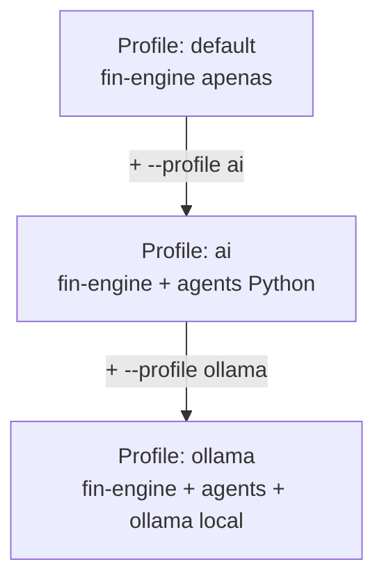

# 08 — Docker

> **Como rodar o FinEngine em containers — desenvolvimento, produção e com IA.**

**Navegação:** [← Database](07-database-supabase.md) | [CLI Reference →](09-cli-reference.md)

---

## Índice

- [Pré-requisitos](#pré-requisitos)
- [Build rápido](#build-rápido)
- [Docker Compose](#docker-compose)
- [Profiles disponíveis](#profiles-disponíveis)
- [Variáveis de ambiente](#variáveis-de-ambiente)
- [Volumes e dados](#volumes-e-dados)
- [Estrutura dos Dockerfiles](#estrutura-dos-dockerfiles)
- [Ambientes de produção](#ambientes-de-produção)

---

## Pré-requisitos

- [Docker Desktop](https://www.docker.com/products/docker-desktop/) (Windows/Mac)
- Docker Engine 24+ (Linux)
- docker-compose v2+ (incluso no Docker Desktop)

Verifique:
```bash
docker --version          # Docker version 24.x.x
docker compose version    # Docker Compose version v2.x.x
```

---

## Build rápido

### Apenas TypeScript (sem IA)

```bash
# Build da imagem
docker build -t fin-engine .

# Demo
docker run --rm -it fin-engine

# Menu interativo
docker run --rm -it fin-engine node packages/cli/dist/index.js start

# Com seu CSV
docker run --rm -it \
  -v /caminho/para/extrato.csv:/app/data/extrato.csv \
  fin-engine node packages/cli/dist/index.js start
```

### Com variáveis de ambiente

```bash
docker run --rm -it \
  -e SUPABASE_URL=https://xxx.supabase.co \
  -e SUPABASE_ANON_KEY=eyJ... \
  fin-engine node packages/cli/dist/index.js start
```

---

## Docker Compose

O `docker-compose.yml` define os serviços:

```bash
# Executar demo
docker compose run --rm fin-engine node packages/cli/dist/index.js demo

# Menu interativo
docker compose run --rm fin-engine

# Build e start
docker compose up --build

# Parar tudo
docker compose down
```

### Recomendação: use o arquivo .env

```bash
# 1. Configure suas variáveis
cp .env.example .env
# edite .env com seus valores

# 2. Compose lê .env automaticamente
docker compose run --rm fin-engine
```

---

## Profiles disponíveis



### Profile `default` (sem flags)

Apenas o container Node.js TypeScript:

```bash
docker compose run --rm fin-engine node packages/cli/dist/index.js demo
```

### Profile `ai`

Adiciona o sidecar Python de IA (requer `LLM_PROVIDER` configurado):

```bash
# Requer LLM_PROVIDER=bedrock (ou openai, anthropic, gemini) no .env
docker compose --profile ai up
docker compose --profile ai run --rm fin-engine node packages/cli/dist/index.js start
```

### Profile `ollama`

Sobe o Ollama localmente como container para IA totalmente gratuita:

```bash
# 1. Sobe o Ollama
docker compose --profile ollama up -d ollama

# 2. Baixa um modelo (na primeira vez)
docker compose --profile ollama exec ollama ollama pull llama3

# 3. Configure o .env
# LLM_PROVIDER=ollama
# OLLAMA_BASE_URL=http://ollama:11434

# 4. Executa com IA local
docker compose --profile ollama run --rm fin-engine \
  node packages/cli/dist/index.js start
```

---

## Variáveis de ambiente

Todas as variáveis do `.env` são passadas automaticamente para os containers.

| Variável | Requerida por | Descrição |
|---|---|---|
| `SUPABASE_URL` | database | URL do projeto Supabase |
| `SUPABASE_ANON_KEY` | database | Chave anon pública |
| `LLM_PROVIDER` | ai profile | Provider de IA |
| `AWS_BEARER_TOKEN_BEDROCK` | bedrock | Token AWS Bedrock |
| `OPENAI_API_KEY` | openai | API Key OpenAI |
| `ANTHROPIC_API_KEY` | anthropic | API Key Anthropic |
| `GEMINI_API_KEY` | gemini | API Key Google Gemini |
| `OLLAMA_BASE_URL` | ollama | URL do servidor Ollama |

---

## Volumes e dados

### Montar seu CSV

```bash
docker run --rm -it \
  -v $(pwd)/extrato.csv:/app/data/extrato.csv \
  fin-engine node packages/cli/dist/index.js start
# Ao selecionar CSV, use o caminho: /app/data/extrato.csv
```

No Windows (PowerShell):
```powershell
docker run --rm -it `
  -v ${PWD}/extrato.csv:/app/data/extrato.csv `
  fin-engine node packages/cli/dist/index.js start
```

### Persistir dados Ollama

O `docker-compose.yml` já configura um volume para o Ollama:

```yaml
volumes:
  ollama_data:   # modelos baixados persistem entre restarts
```

---

## Estrutura dos Dockerfiles

### `Dockerfile` (TypeScript)

```dockerfile
# Estágio 1: Instala dependências
FROM node:20-alpine AS deps
WORKDIR /app
COPY package.json pnpm-workspace.yaml pnpm-lock.yaml* ./
COPY packages/*/package.json ./packages/
RUN npm install -g pnpm && pnpm install --frozen-lockfile

# Estágio 2: Build
FROM deps AS builder
COPY . .
RUN pnpm build

# Estágio 3: Runtime (imagem mínima)
FROM node:20-alpine AS runner
WORKDIR /app
RUN npm install -g pnpm
COPY --from=builder /app/node_modules ./node_modules
COPY --from=builder /app/packages ./packages
COPY --from=builder /app/package.json ./
CMD ["node", "packages/cli/dist/index.js", "demo"]
```

**Multi-stage benefits:**
- Imagem final não contém devDependencies
- Camadas de build em cache
- Imagem ~200MB vs ~600MB sem multi-stage

### `services/agents/Dockerfile` (Python)

```dockerfile
FROM python:3.12-slim

WORKDIR /app
RUN pip install uv

COPY pyproject.toml uv.lock* ./
RUN uv sync --frozen

COPY src/ ./src/
CMD ["python", "-m", "agents"]
```

---

## Ambientes de produção

### docker-compose.yml completo

```yaml
services:
  fin-engine:
    build: .
    env_file: .env
    volumes:
      - ./data:/app/data  # CSVs montados aqui
    stdin_open: true
    tty: true

  agents:
    build: services/agents
    env_file: .env
    profiles: [ai, ollama]

  ollama:
    image: ollama/ollama
    volumes:
      - ollama_data:/root/.ollama
    ports:
      - "11434:11434"
    profiles: [ollama]

volumes:
  ollama_data:
```

### Healthchecks

Para usar em ambientes de produção, adicione healthchecks:

```yaml
services:
  fin-engine:
    healthcheck:
      test: ["CMD", "node", "-e", "console.log('ok')"]
      interval: 30s
      timeout: 10s
      retries: 3
```

### Segurança

- ❌ Nunca inclua `.env` na imagem Docker (está no `.dockerignore`)
- ✅ Use `docker secrets` ou variáveis de ambiente do host em produção
- ✅ Use a imagem `node:20-alpine` (não `latest`) para builds reproduzíveis
- ✅ Execute o container como usuário não-root em produção:

```dockerfile
RUN addgroup -S finengine && adduser -S finengine -G finengine
USER finengine
```

---

**Navegação:** [← Database](07-database-supabase.md) | [CLI Reference →](09-cli-reference.md)
