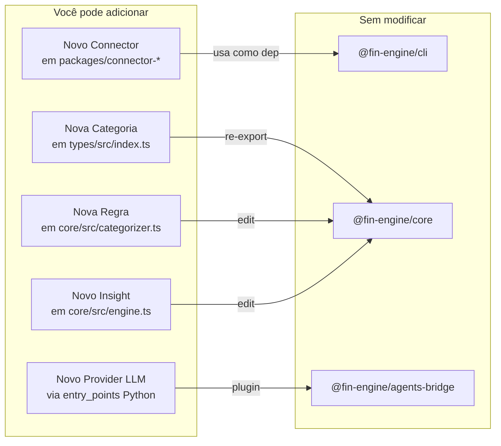

# 10 — Customização

> **Como estender o FinEngine: novas categorias, connectors, providers de IA e mais.**

**Navegação:** [← CLI Reference](09-cli-reference.md) | [Contribuindo →](11-contributing.md)

---

## Índice

- [Adicionar categorias](#adicionar-categorias)
- [Criar connector customizado](#criar-connector-customizado)
- [Criar provider de IA customizado](#criar-provider-de-ia-customizado)
- [Customizar regras de insight](#customizar-regras-de-insight)
- [Customizar display do terminal](#customizar-display-do-terminal)
- [Usar como biblioteca](#usar-como-biblioteca)

---

## Adicionar categorias

As 13 categorias atuais são definidas em `packages/types/src/index.ts`:

```typescript
export type Category =
  | 'income' | 'housing' | 'food' | 'transport'
  | 'health' | 'education' | 'entertainment'
  | 'shopping' | 'utilities' | 'investment'
  | 'transfer' | 'fee' | 'other'
```

### Para adicionar uma categoria

**1. Adicione ao tipo:**
```typescript
// packages/types/src/index.ts
export type Category =
  | 'income' | 'housing' | 'food' | 'transport'
  | 'health' | 'education' | 'entertainment'
  | 'shopping' | 'utilities' | 'investment'
  | 'transfer' | 'fee'
  | 'pet'    // ← nova categoria
  | 'other'
```

**2. Adicione regras no categorizador:**
```typescript
// packages/core/src/categorizer.ts
// Adicione antes das regras de 'other':
{
  pattern: /pet\s*shop|veterinário|veterinario|petlove|cobasi|petz/i,
  category: 'pet' as Category,
},
```

**3. Adicione label para display:**
```typescript
// packages/cli/src/ui/display.ts
const CATEGORY_LABELS: Record<Category, string> = {
  // ...existentes...
  pet: 'Pets',
}
```

**4. Rebuild:**
```bash
pnpm build
pnpm demo
```

---

## Criar connector customizado

Veja o guia completo em [04-connectors.md](04-connectors.md#criar-um-connector-customizado).

**Resumo:**

```typescript
// packages/connector-meu-banco/src/index.ts
import { BaseConnector } from '@fin-engine/connectors-base'
import type { Transaction } from '@fin-engine/types'

export class MeuBancoConnector extends BaseConnector {
  readonly name = 'meu-banco'

  async getTransactions(): Promise<Transaction[]> {
    // sua implementação
    return []
  }
}
```

---

## Criar provider de IA customizado

Veja o guia completo em [06-ai-agents.md](06-ai-agents.md#criar-um-provider-customizado).

**Resumo:**

```python
# meu_provider/provider.py
from agents.llm.base import LLMProvider

class MeuProvider(LLMProvider):
    @property
    def name(self) -> str:
        return "meu-provider"

    def complete(self, *, system: str, user: str, **kwargs) -> str:
        # chame sua API aqui
        return "texto gerado"
```

Registre no `pyproject.toml`:
```toml
[project.entry-points."fin_engine.llm_providers"]
meu-provider = "meu_provider.provider:MeuProvider"
```

Ative:
```env
LLM_PROVIDER=meu-provider
```

---

## Customizar regras de insight

Os insights rule-based são gerados em `packages/core/src/engine.ts`.

### Adicionar um insight customizado

```typescript
// packages/core/src/engine.ts — dentro de generateInsights()

// Exemplo: alertar quando gastos com entretenimento > 10%
const entertainment = result.categoryBreakdown.find(
  (b) => b.category === 'entertainment'
)
if (entertainment && entertainment.percentage > 10) {
  insights.push({
    id: `entertainment-high-${Date.now()}`,
    level: 'warning',
    message: `Entretenimento representa ${entertainment.percentage.toFixed(1)}% dos gastos`,
    detail: 'Considere revisar assinaturas e serviços de streaming.',
    category: 'entertainment',
    value: entertainment.total,
  })
}
```

### Níveis de insight

| Level | Cor no terminal | Quando usar |
|---|---|---|
| `alert` | 🚨 Vermelho | Problema sério (poupança negativa, dívida) |
| `warning` | ⚠️ Amarelo | Tendência preocupante |
| `info` | ℹ️ Azul | Informação útil, recorrências, status positivo |

---

## Customizar display do terminal

O display é controlado por `packages/cli/src/ui/display.ts`.

### Customizar cores

```typescript
// Altere as constantes de cor:
const colors = {
  primary: chalk.cyan,
  success: chalk.green,
  warning: chalk.yellow,
  alert: chalk.red,
  info: chalk.blue,
  muted: chalk.gray,
}
```

### Customizar gráficos de barra

```typescript
// Altere a largura máxima da barra:
const BAR_WIDTH = 30  // padrão: 20

// Altere os caracteres:
const BAR_FILLED = '█'
const BAR_EMPTY = '░'
```

### Adicionar seções ao output

```typescript
// packages/cli/src/ui/display.ts
export function displayCustomSection(data: SeuTipo) {
  console.log(chalk.bold.cyan('\n🎯  MINHA SEÇÃO'))
  // seu código aqui
}
```

Chame em `packages/cli/src/commands/demo.ts` ou `start.ts`.

---

## Usar como biblioteca

O FinEngine pode ser usado programaticamente em qualquer projeto Node.js:

### Instalar

```bash
# Se estiver no monorepo
pnpm add @fin-engine/core @fin-engine/connector-mock

# Se publicado no npm (futuro)
npm install @fin-engine/core @fin-engine/connector-mock
```

### Uso básico

```typescript
import { MockConnector } from '@fin-engine/connector-mock'
import { CsvConnector } from '@fin-engine/connector-csv'
import { FinancialEngine } from '@fin-engine/core'
import type { EngineResult } from '@fin-engine/types'

async function analisar(csvPath?: string): Promise<EngineResult> {
  const connector = csvPath
    ? new CsvConnector(csvPath)
    : new MockConnector()

  await connector.connect()
  const transactions = await connector.getTransactions()

  const engine = new FinancialEngine()
  return engine.analyze(transactions)
}

// Uso
const result = await analisar('./extrato.csv')
console.log(`Poupança: ${result.savingsRate.toFixed(1)}%`)
console.log(`Insights: ${result.insights.length}`)

for (const insight of result.insights) {
  console.log(`[${insight.level}] ${insight.message}`)
}
```

### Acesso a funções individuais

```typescript
import {
  categorize,
  categorizeAll,
  buildCategoryBreakdown,
  detectPatterns,
} from '@fin-engine/core'

// Categorizar uma descrição
const cat = categorize('Supermercado Carrefour')
// → 'food'

// Categorizar transações em massa
const categorized = categorizeAll(minhasTransacoes)

// Calcular breakdown sem usar o FinancialEngine
const breakdown = buildCategoryBreakdown(categorized)
```

### Integração com Supabase

```typescript
import { isConfigured, saveAnalysisSession } from '@fin-engine/database'

const result = engine.analyze(transactions)

if (isConfigured()) {
  const session = await saveAnalysisSession({
    sourceConnector: 'minha-fonte',
    result,
  })
  console.log('Salvo:', session.id)
}
```

---

## Referência de extensão



---

**Navegação:** [← CLI Reference](09-cli-reference.md) | [Contribuindo →](11-contributing.md)
